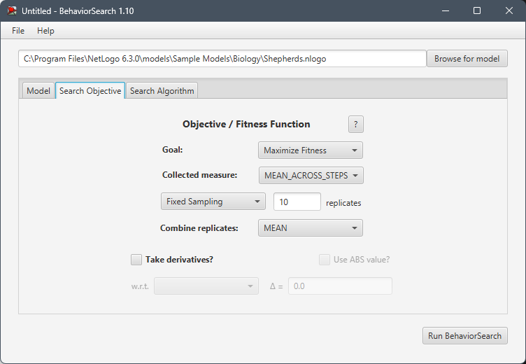

## СПм-23-5, Шевченко Ілля Олександрович
### Лабораторна робота №**3**. Використання засобів обчислювального интелекту для оптимізації імітаційних моделей

 

### Варіант 9, модель у середовищі NetLogo:
[Shepherds](http://www.netlogoweb.org/launch#http://www.netlogoweb.org/assets/modelslib/Sample%20Models/Biology/Shepherds.nlogo)

 

### Вербальний опис моделі:
Ця модель наслідує поведінку двох природних явищ: будівництва мурашників термітами та пасіння овець. Уявіть собі поле, де вівці бігають куди хочуть. Пастухи намагаються зігнати їх в одну отару. Чи вдасться їм це, залежить від кількості пастухів та їхньої швидкості.

Кожен пастух діє за простими правилами: спочатку він ходить навмання. Побачивши вівцю, він бере її з собою і продовжує блукати. Якщо ж він зустріне іншого пастуха з вівцею, то знайде вільне місце неподалік і покладе свою вівцю туди, а потім піде шукати інших.

### Параметри Setup:
- **num-shepherds** - кількість пастухів на початку.
- **num-sheep** - кількість овець на початку.

### Параметри, що можуть надавати вплив під час роботи симуляції:
- **sheep-speed** - Швидкість овець.

### Показники роботи системи:
- current efficiency - відображає поточну ефективність вівчарства.
- Herding Efficiency - графік, що відображає ефективність вівчарства протягом симуляції.

 

### Налаштування середовища BehaviorSearch:

**Обрана модель**:
<pre>
C:\Program Files\NetLogo 6.3.0\models\Sample Models\Biology\Shepherds.nlogo
</pre>

**Параметри моделі** (вкладка Model):

*Параметри та їх можливі діапазони були **автоматично** вилучені середовищем BehaviorSearch із вибраної імітаційної моделі, для цього є кнопка «Завантажити діапазони параметрів із інтерфейсу моделі»*:

<pre>
["num-sheep" [0 1 500]]
["num-shepherds" [0 1 100]]
["sheep-speed" [0 0.01 0.2]]
</pre>
Використовувана **міра**:  
Для фітнес-функції *(вона ж функція пристосованості або цільова функція)* було обрано **значення середньої ефективності**.
та вказано у параметрі "**Measure**":
<pre>
mean [herding-efficiency] of turtles
</pre>

Середня ефективність всіх здобувачів повинна враховуватися **в середньому** за весь період симуляції тривалістю 3000 тактів, починаючи з 0 такту симуляції.  
*Параметр "**Mesure if**" зі значення true, по суті, і означає, що враховуватимуться всі такти симуляції, а чи не частина їх. Іноді має сенс не враховувати деякі такти через хаос в деяких моделях на початку їх використання. Наприклад, це показано в прикладі з документації BehaviorSearch.  
Параметри "**Setup**" та "**Go**" вказують відповідні процедури ініціалізації та запуску в логіці моделі (зазвичай вони так і називаються). BehaviorSearch в процесі роботи, по суті, замість користувача запускає ці процедури.*  
Параметр зупинки за умовою ("**Stop if**") у разі не використовувався.  

Загальний вигляд вкладки налаштувань параметрів моделі:

**Налаштування цільової функції** (вкладка Search Objective):  
Метою підбору параметрів імітаційної моделі є **максимізація** значення середньої енергії здобувачів – це вказано через параметр "**Goal**" зі значенням **Maximize Fitness**. Тобто необхідно визначити такі параметри налаштувань моделі, у яких здобувачі у процесі життя та розмноження покращують середнє значення енергії у окремого здобувача. При цьому цікавить не просто середня швидкість всіх машин у якийсь окремий момент симуляції, а середнє її значення за всю симуляцію (тривалість якої (3000 кроків) вказувалася на минулій вкладці). Для цього у параметрі "**Collected measure**", що визначає спосіб обліку значень обраного показника, вказано **MEAN_ACROSS_STEPS**.  
Щоб уникнути викривлення результатів через випадкові значення, що використовуються в логіці самої імітаційної моделі, **кожна симуляція повторюється по 10 разів**, результуюче значення розраховується як **середнє арифметичне**. 

Загальний вигляд вкладки налаштувань цільової функції:

**Налаштування алгоритму пошуку** (вкладка Search Algorithm):  

Загальний вид вкладки налаштувань алгоритму пошуку для Генетичного алгоритму:

Загальний вид вкладки налаштувань алгоритму пошуку для Випадкового пошуку:

 

### Результати використання BehaviorSearch:

Діалогове вікно запуску пошуку:

Результат пошуку параметрів імітаційної моделі, використовуючи **генетичний алгоритм**:

Результат пошуку параметрів імітаційної моделі, використовуючи **випадковий пошук**:

Аналіз результатів показав, що випадковий пошук забезпечує вищі значення фітнес-функції порівняно з генетичним алгоритмом. Однак, цей метод призводить до повного вимирання популяції овець, що робить його непридатним для використання в даному контексті.

### Висновок:

Проведене дослідження за допомогою інструменту BehaviorSearch демонструє ефективність застосування обчислювального інтелекту для оптимізації параметрів імітаційної моделі «Shepherds». Ця модель, що симулює процес пасіння овець, була піддана аналізу з метою визначення оптимальних значень параметрів, які б забезпечили максимальну ефективність збирання овець у стадо.

Було проведено порівняльний аналіз двох алгоритмів пошуку: генетичного та випадкового. Обидва алгоритми дозволили знайти набори параметрів, що призводять до підвищення ефективності пасіння. Однак, детальний аналіз результатів показав, що випадковий пошук, незважаючи на досягнення вищих значень цільової функції, призводить до небажаного наслідку – повного вимирання популяції овець. Таким чином, генетичний алгоритм виявився більш придатним для вирішення поставленої задачі, оскільки забезпечує баланс між ефективністю пасіння та збереженням популяції.
